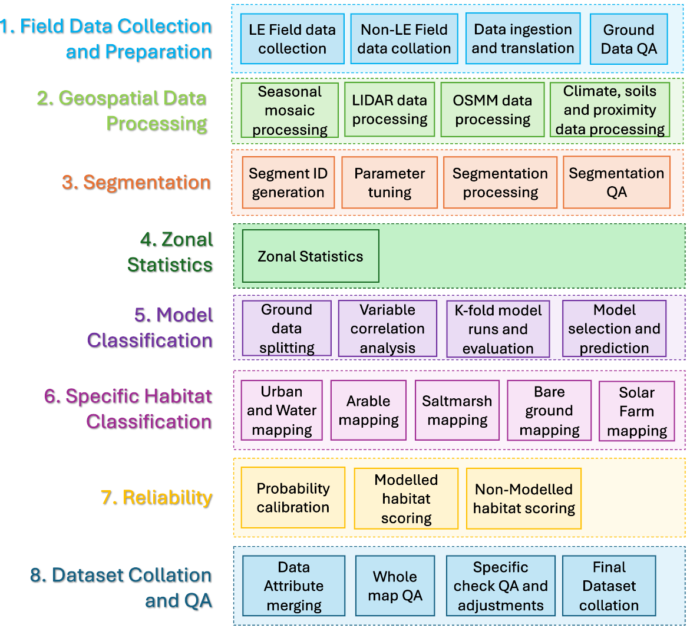

# The Living England Project

## About the Project
The Living England (LE) project, led by Natural England, is a multi-year programme delivering a satellite-derived national habitat map showing the extent and distribution of England’s diverse broad habitats. This is in support of the Defra Environmental Land Management (ELM) schemes and the National Capital and Ecosystem Assessment (NCEA) Programmes. The project uses European Space Agency Sentinel-1 and Sentinel-2 imagery, alongside additional open source datasets, machine learning modelling and is supported by a national targetted field data collection programme.

The current Living England habitat probability map for England is openly available to view on Defra's MAGIC platform, Defra's Data Services Platform, data.gov.uk and NE's Open data Platform, under an Open Government Licence v3.0.

## The Living_England repository

Living England is an ongoing long running project,  the code in this repository reflects the standardised method used to produce the Living England habitat maps from 2024 onwards (Living England 2022-23 map publication). The scripts are subject to change as improvements and optimisations are made to the reproducible analytical workflows. If you would like to be informed of any changes as they happen, please contact the team using the email address provided below.

The code has been specifically written for LE, and has intricacies that are unique to the project that will likely need to be updated or rewritten before being used on other projects. An example of this is the sub-division of England into BioGeographic Zones (bgzs). These are regional divisions to allow for the spatial variations in vegetation composition to be captured and to support acquisition of cloud-free imagery. The boundaries of these zones are based on the National Character Area boundaries and the Sentinel-2 satellite orbits, are are available from: <a href="https://www.data.gov.uk/dataset/8c36c913-eae3-411e-af2f-4d375d40a074/biogeographic-zones-living-england-2021)">Biogeographic Zones</a>.

The repository is split up into 'Workflow' scripts which call the filepaths and functions used in each step of the workflow, and 'Function' scripts where discrete functions are reused for particular tasks. These follow the processing workflow detailed in the diagram below.

### Workflow Scripts and accompanying Function scripts
<ol>
  
  <li> <b> Field data collection and preparation </b>
<ul>
  <li> Data Ingestion - The '1_Ground_Truth_Data_Ingestion' workflow script sets out how survey data is prepared, cleaned and translated for use in LE. <i>Calling on function scripts: '1_connect_to_access_database.R', '1_find_translation_path.R', '1_translate_survey_dat.R', '1_assign_segments_to_survey_data.R', '1_clean_coord_check.R'.</i> </li>
   <li> Habitat Data QA - The '1_Habitat_Data_QA' workflow script performs quality assurance steps on the LE ground dataset.<i>Calling on function scripts: 'common_functions_library.R', '1_habitat_data_QA_checks.R'.</i> </li>
  </ul></li>
  
  <li> <b> Geospatial data processing </b>
<ul>
  <li> SAR rainfall screening - The ' 2_SAR_rainfall_screening' folder contains workflow scripts for performing weather checking on Sentinel-1 imagery to return a list of acquisition dates where the imagery may be impacted. </li>
  <li> Create Sentinel-1 seasonal mosaics - The ' 2_S1_Mosaic_creation.ipynb' workflow script for performing pre-processing steps on the Sentinel-1 backscatter imagery with GEE and compiling seasonal mosaics for Spring, Summer and Autumn. </li>
 <li> Create Sentinel-2 seasonal mosaics - The ' 2_S2_Mosaic_creation.ipynb' workflow script for performing pre-processing steps on the Sentinel-2 optical imagery with GEE and compiling seasonal mosaics for Spring, Summer and Autumn.</li>
    <li>  Create an extended DEM from multiple elevation datasets - The ' 2_Merge_DEM.pynb' workflow script creates an extended DEM dataset from EA LiDAR, EA integrated height model and NASA SRTM data which covers beyonds the boundaries of the OS England terrestrial extent. This is required for the Sentinle-1 coherence workflow. </li>
  <li> Create Sentinel-1 coherence composites - The ' 2_S1_Coherence' folder is a series of scripts for calculating coherence composites. A seperate pdf file, 'S1_SNAP_processing.pdf', is provided which details the processing steps and datasets required</li>
  <li> Preprocess Climate datasets - The ' 2_HadUK_Climate_PreProcess.R' workflow script prepares data from Met Office HadUK data product to create 2-year and 20-year annual and seasonal composites. <i>Calling on function scripts: '2_HadUK_Climate_PreProcess.R'.</i> </li>
  <li> Preprocess OSMM water and urban datasets - The ' 2_OSMM_Water_Urban_Preprocess.R' workflow script selects the required data from OS MasterMap for informing the Built-up areas and gardens and water classes in LE maps. <i>Calling on function scripts: 'OSMM_Water_Urban_Preprocess_Functions.R'.</i> </li>
</ul></li>

 <li> <b> Segmentation </b>
 The main segmentation processing is carried out with eCognition v.10.2. Following the image segmentation steps the below scripts are applied.
   <ul>
   <li> Assigning segment IDs - The '3_Generate_Segment_IDs.R' workflow script assigns a unique identifier to each segment in the LE spatial framework, generated in Ecognition using the Sentinel-2 seasonal mosaics, LiDAR derived datasets and OSMM urban and water features.</li>
</ul></li>

 <li> <b> Zonal Statistics </b>
   <ul>
   <li> Calculating zonal statistics within segments - The '4_zonalStats.R' workflow script calculates for each segment in the LE spatial framework the minimum, maximum, mean and standard deviation of the pixels within each of the predictor datasets. This is a modular function and includes the S1, S2 and LiDAR layers, NDVI, NDWI, Soils and Climate datasets. Prior to this it also performs correction on the S2 seasonal mosaics where these are exported from GEE with 0 values for cloud correcting these to NA values, and calculates NDVI and NDWI indices layers. <i>Calling on function scripts: '4_calc_indices.R', '4_cloud_removal_NAs.R', '4_zonalStats_exactExtract_function'.</i> </li>
</ul></li>

<li> <b> Model Classification </b>
   <ul>
   <li> Distributed Random Forest Classification model and reliability scoring- The '5_model_based_classification.R' workflow script performs pre-modelling steps and then trains and predicts an object-based habitat classification using a distributed random forest model, utilising the h2o package. This workflow also calculates the reliability scoring for the modelled habitat classes through callibrating model probabilities and returns this per segment alongside predictions. <i> Calling on function scripts: '5_RF_modelling_functions.R', 'common_functions_library.r'.</i> </li>
</ul></li>

<li> <b> Specific Habitat Classification </b>
   <ul>
   <li> Individual habitat mapping for non-modelled habitats - The '6_Vector_Based_Classification.R' workflow script works through bespoke analysis and habitat map creation for Built-up areas and gardens, Water, Arable, Bare Ground, Coastal Saltmarsh and Solar Farm classes. This workflow compiles these layers together with the segmentation assigning these in a hierarchical order. <i> Calling on function scripts: '6_assign_hierarchical_vector_habitats.R', '6_vector_classification_segment_overlap.R'.</i></li>
</ul></li>

<li> <b> Reliability </b>
 Reliability scoring incorporated into 'Model Classification' & 'Dataset Collation and QA' </li>

<li> <b> Dataset Collation and QA </b>
   <ul>
   <li> Dataset compilation - The '8_Final_Class_Assessment_&_QC.R' workflow script compiles the final dataset from the modelled and specific habitat classification mapping. This also assigns the reliability scoring for the specific habitat classification classes and clips the terrestrial habitats to OS Mean High Water Springs (MHWS) with the exception of saltmarsh where this extends to the full reach of the intertidal zone. <i> Calling on function scripts: 'common_functions_library.R'</i></li>
<li> Extracts data for quality assurance checks - The '8_QA_QC_ChecksC.R' workflow script runs through a series of extractions of subsets of data for specific quality checks on the final dataset which require visual inspection. This then commits any adjustments identified from the QA checks and compiles the final dataset as a geopackage. <i> Calling on function scripts: 'common_functions_library.R'</i></li>
<li> Extracts area statistics for the final LE map - The '8_Dataset_Area_Stats.R' workflow script to calculate summary statistics of the habitat predictions and reliability scores. <i> Calling on function scripts: 'common_functions_library.R'</i></li>
</ul></li>

</ol>

## Further Information
For further detail on the methods detailed and production of the Living England habitat map, please refer to the accompanying Technical User Guide: <a href="https://publications.naturalengland.org.uk/">Living England 2022-23 Technical User Guide</a>

## Copyright

© Natural England 2024

### Contact
The Living England team are happy to answer any queries regarding the project, and welcome any suggested improvements and/or bugs reports for the code. The LE team are also keen to hear from anyone who is using the Living England code and applying it in their own work. Please contact the LE team at livingenglandenquiries@naturalengland.org.uk

## Acknowledgements
The Natural England Living England project is funded through the Defra National Capital and Ecosystem Assessment (NCEA), 
and Environmental Land Management schemes (ELMs) programmes. Thanks go to the many colleagues and partners within Natural England, Defra group and JNCC and to the landowners and surveyors engaged witht the project for their collaboration on the project.

